# Hire Flow - Automated Resume Screening and Interview Scheduling

Full-stack project with:
- Frontend: React (Vite), Tailwind CSS, modular role-based dashboards
- Backend: Node.js + Express, JWT auth, RBAC, MySQL + MongoDB
- Deployment configs: Vercel/Netlify (frontend) and Render (backend)

---

## Screenshots

### Auth & Security
**Register Page**
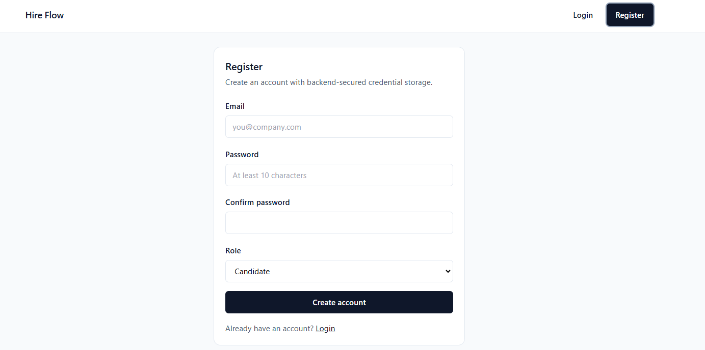

**Login Screen**
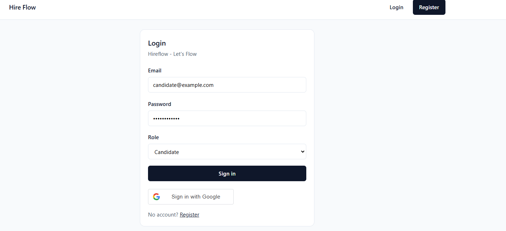

**Login Screen - RBAC Denied**
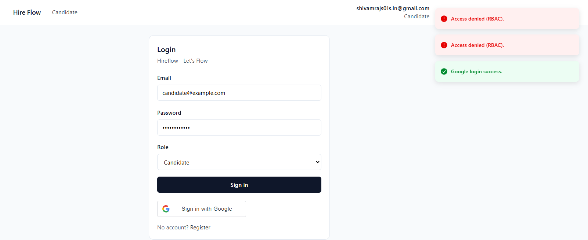

### Candidate Workflow
**Candidate UI - Resume uploading and processing**
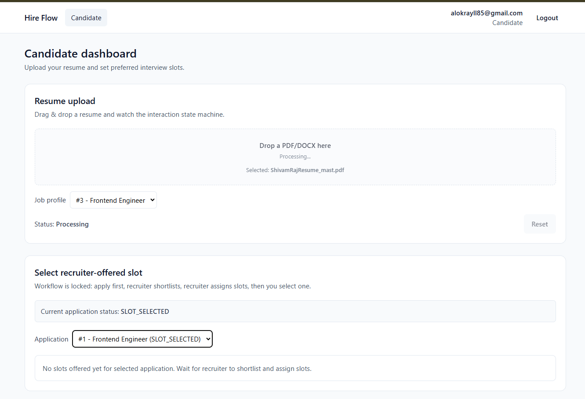
**Duplicate application detection**
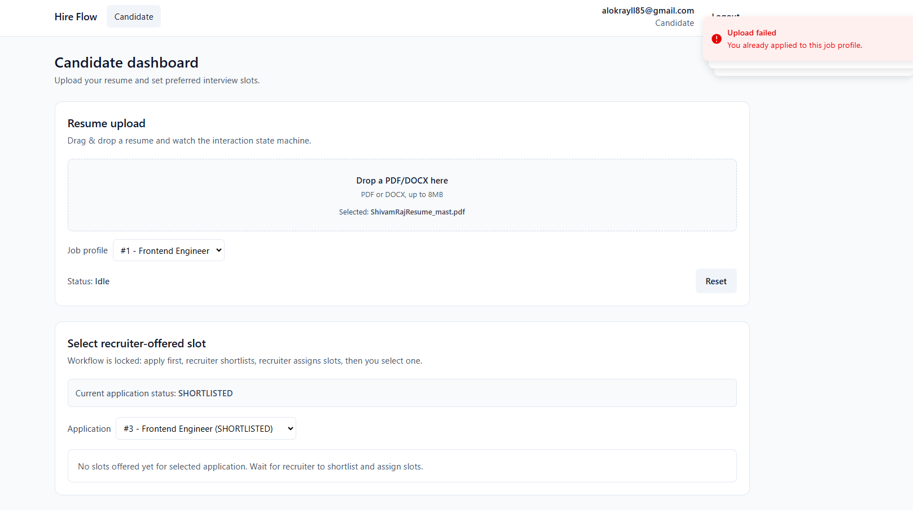
### Recruiter Workflow
**Recruiter UI - Recruitment page**
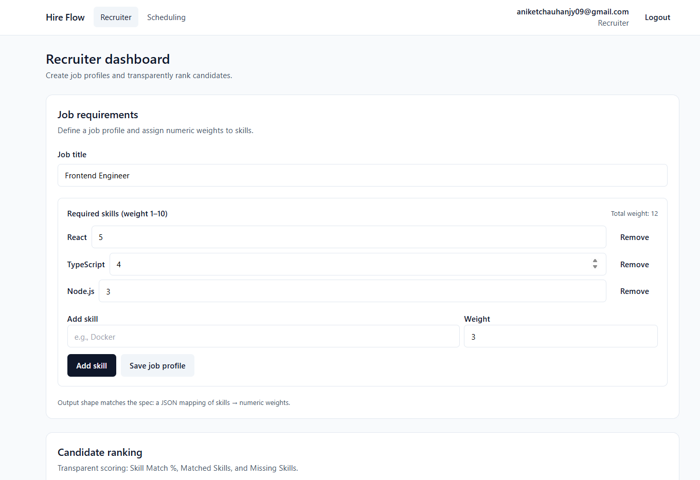

**Top shortlisted candidate**
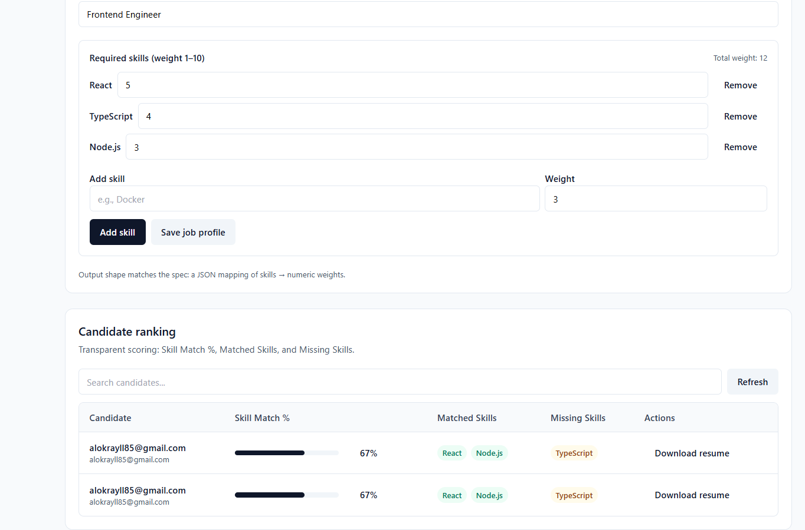

**Recruiter UI - Scheduling page**
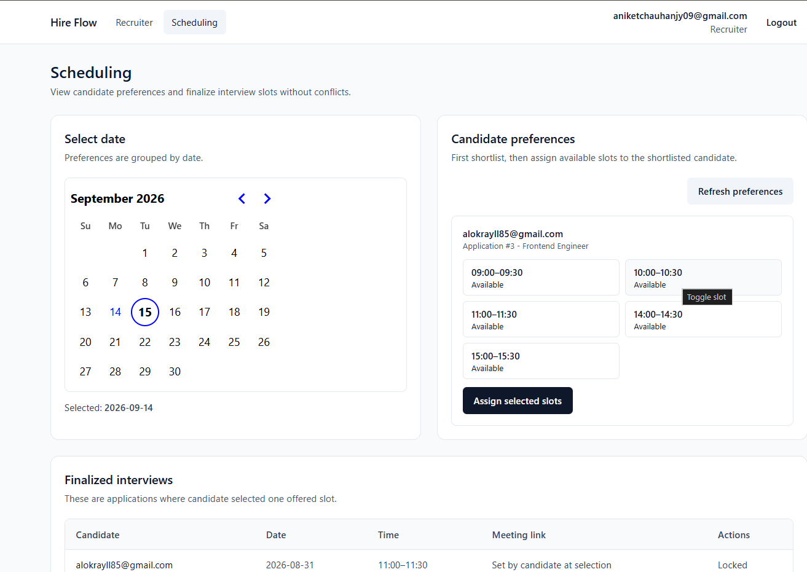

**Email verification shortlisted**
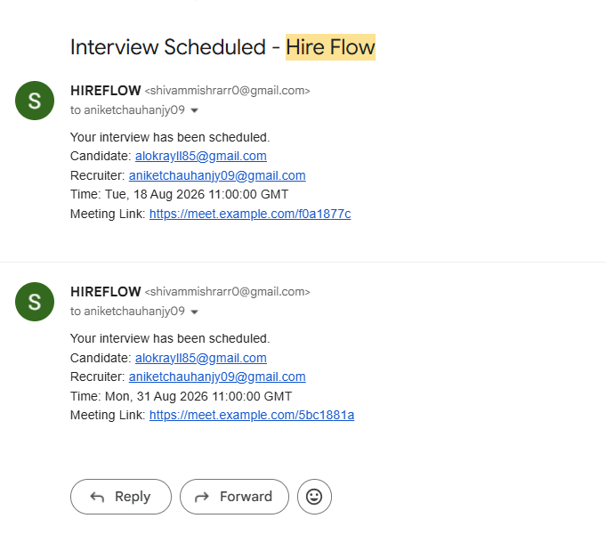
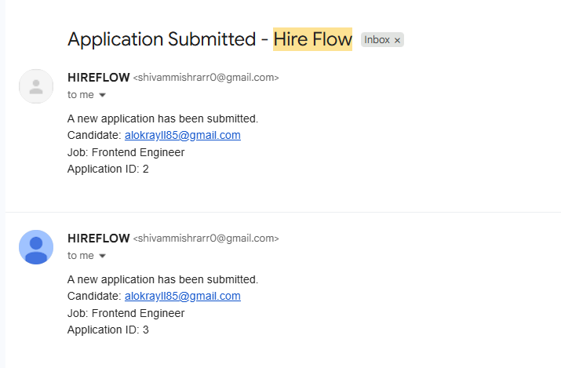

### Administration Workflow
**Administration UI - Register page asking for admin code**
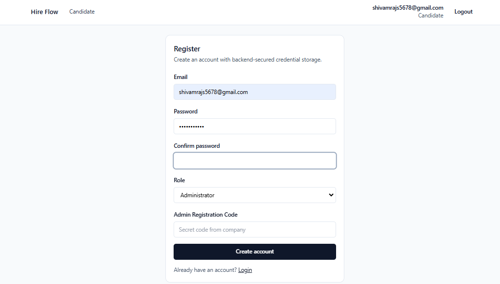

**Administration UI - Admin Dashboard**
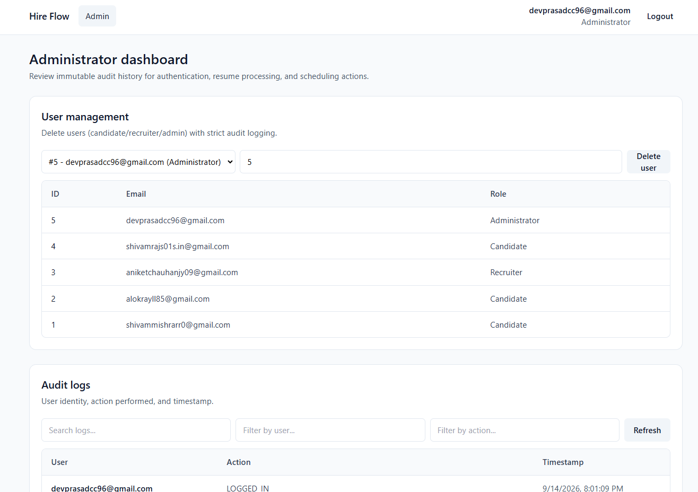

**Administration UI - Logs/Filter (before delete action)**
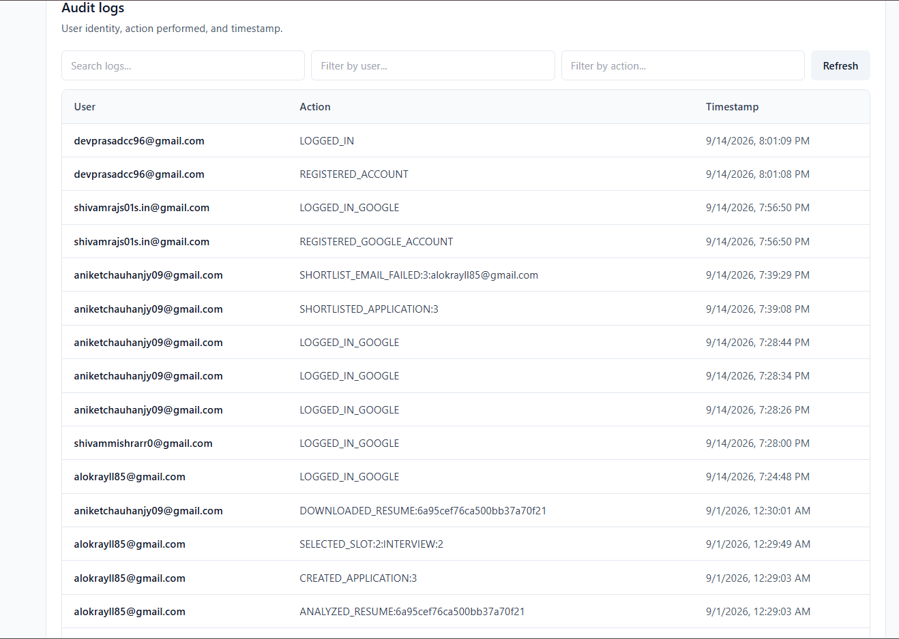
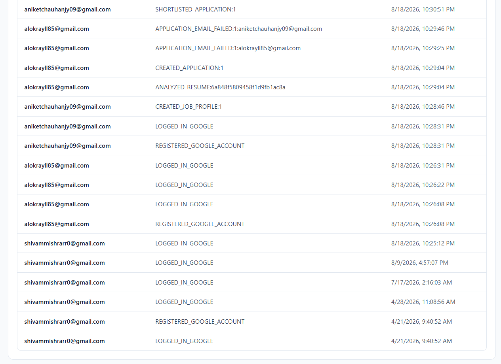

**Administration UI - Delete User +log after delete**
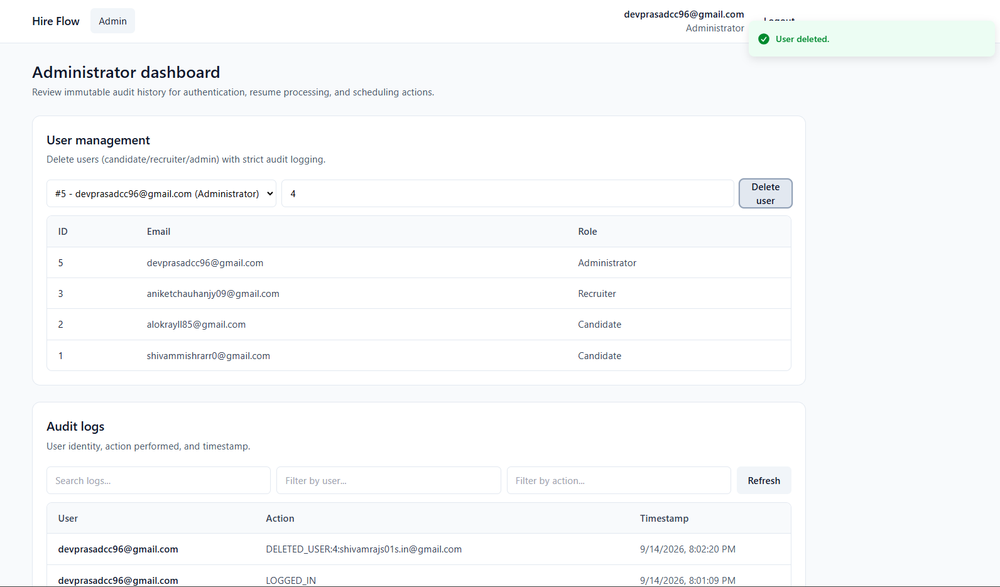

---

## Features

### Tech Stack & Architecture
- **Frontend**: React (Vite) with Tailwind CSS for a responsive, modern UI.
- **Backend**: Node.js & Express API.
- **Databases**: MySQL (Sequelize) for relational data and MongoDB (Mongoose) for unstructured resume storage.
- **Authentication**: JWT-based email/password login, Google OAuth integration, and strict Role-Based Access Control (RBAC).

### Core Functionality
- **Multi-Role Dashboards**: Dedicated workspaces for Candidates, Recruiters, and Administrators.
- **Resume Processing Pipeline**: NLP-powered text extraction, tokenization, bias minimization, and weighted candidate scoring.
- **Automated Interview Scheduling**: Candidate slot preferences and recruiter finalization.
- **Admin Audit Logging**: Comprehensive action tracking and grid views for administrators.
- **Email Notifications**: Integrated Nodemailer for sending automated updates.
- **Secure Registration**: Admin accounts protected by secure environment-based registration codes.

---

## Project Structure

```text
Hire_Flow/
  frontend/
    src/
      routes/
      views/
        auth/
        candidate/
        recruiter/
        admin/
      shared/
        ui/
        security/
      main.tsx
    vercel.json
    netlify.toml
    package.json

  backend/
    src/
      constants/
      controllers/
      db/
      errors/
      middleware/
      models/
        sql/
        mongo/
      nlp/
      routes/
      services/
      utils/
    server.js
    .env.example
    package.json
    README_PHASE2.md

  render.yaml
```

---

## Backend Functional Flow

1. Client sends request to `/api/*`
2. Security middleware applies (`helmet`, `cors`, rate-limit, payload limits)
3. Protected routes validate JWT (`Authorization: Bearer <token>`)
4. RBAC middleware checks role (Candidate/Recruiter/Administrator)
5. Controller executes business logic
6. Data is stored/read from:
   - MySQL (users/jobs/interviews/audit logs)
   - MongoDB (`ResumeData`)
7. Audit log entry is recorded for important actions
8. Standard JSON response/error returned

---

## Local Setup

### Prerequisites
- Node.js 18+
- MySQL server
- MongoDB server

### 1) Backend

```bash
cd backend
npm install
```

Create `.env` from example:

```bash
cp .env.example .env
```

Then run:

```bash
npm run dev
```

Health check:
- `http://localhost:3001/health`

### 2) Frontend

```bash
cd frontend
npm install
cp .env.example .env
npm run dev
```

Frontend default:
- `http://localhost:5173`

---

## Backend API Map

Base URL: `http://localhost:3001/api`

- Auth
  - `POST /auth/register`
  - `POST /auth/login`
  - `POST /auth/google`
  - `GET /auth/me`

- Candidate
  - `POST /candidate/resume/analyze`
  - `POST /candidate/preferences`
  - `GET /candidate/interviews`

- Recruiter
  - `POST /recruiter/job-profiles`
  - `GET /recruiter/candidates/ranking`
  - `GET /recruiter/candidate-preferences`
  - `POST /recruiter/interviews/finalize`

- Admin
  - `GET /admin/audit-logs`

- Interviews
  - `GET /interviews/calendar`

---

## Environment Variables (Backend)

See `backend/.env.example`.

Minimum required:
- `PORT`
- `CORS_ORIGIN`
- `MYSQL_HOST`, `MYSQL_PORT`, `MYSQL_DATABASE`, `MYSQL_USER`, `MYSQL_PASSWORD`
- `MONGODB_URI`
- `JWT_SECRET` (long random string, at least 32 chars)
- `JWT_EXPIRES_IN`
- `GOOGLE_CLIENT_ID`
- `SMTP_HOST`, `SMTP_PORT`, `SMTP_SECURE`, `SMTP_USER`, `SMTP_PASS`, `SMTP_FROM`
- `ADMIN_REGISTRATION_CODE`

---

## Deployment

### Frontend
- Vercel: `frontend/vercel.json`
- Netlify: `frontend/netlify.toml`

### Backend (Render)
- Blueprint: `render.yaml`
- Service root: `backend/`
- Start command: `npm start`

---

## Security and Quality Notes

- Password hashes stored using bcrypt
- No secrets hardcoded in source
- JWT validation + role checks on protected routes
- Request rate limiting and input payload limits
- Centralized error handling
- Modular code organization for maintainability

---

## Pending Enhancements (Optional Next Phase)

- API request validation layer (Zod/Joi/express-validator)
- Swagger/OpenAPI docs
- Reminder scheduler (cron/queue) for interview reminder emails
